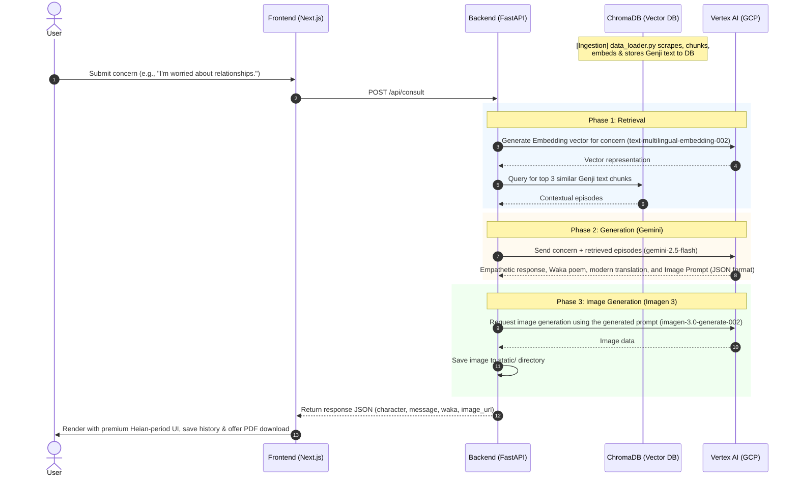

# Genji Mirror 🪞

> Thousand-Year Empathy Engine — The characters of The Tale of Genji will empathize with your concerns

[](https://nextjs.org/)
[](https://fastapi.tiangolo.com/)
[](https://cloud.google.com/vertex-ai)

## Overview

**Genji Mirror** is a web application that recreates the worldview of the classic literature "The Tale of Genji" from over 1000 years ago using AI. It provides deep empathy and Waka poems from the perspective of the characters in response to the concerns of modern people.

### Key Features

- 🔍 **RAG Search**: Search related scenes from The Tale of Genji using ChromaDB + Vertex AI Embeddings.
- 💬 **AI Empathy Messages**: Deep empathetic messages generated by Gemini 2.5 Flash from the characters' perspectives.
- 🎨 **Scroll-style Image Generation**: Heian scroll-style illustrations generated by Imagen 3.
- 📜 **Waka Generation**: Generation and translation of classic Waka poems suited to the situation.
- 🔐 **Authentication**: Registration, login, and password reset functionality using JWT.
- 👘 **Avatar Selection**: Choose between Hikaru Genji, Murasaki Shikibu, The Emperor, or Lady Rokujo.
- 📄 **PDF Download**: Save the oracle card as a PDF.
- 🔗 **Social Sharing**: Share on X, Facebook, Instagram, and LinkedIn.

## Architecture

The project consists of a Next.js frontend and a FastAPI backend.
The Next.js frontend is built with the new App Router, providing a rich, interactive UI using Tailwind CSS and Framer Motion.
The FastAPI backend acts as the core API server, providing authentication, data retrieval, and integration with Google Cloud Vertex AI.

### System Diagram

```mermaid
graph TD
    User([User]) <--> |1. Input Concern & View Result| FE[Frontend<br/>Next.js / React]
    FE <--> |2. Proxy /api/consult| BE[Backend<br/>FastAPI]
    
    subgraph FastAPI_Backend [FastAPI Backend]
        API[Consult API]
        Auth[Auth API]
        SQLite[(SQLite <br/>users.db)]
        DB[(ChromaDB <br/>Vector Database)]
        
        API <--> |3. Query Similarity| DB
        Auth <--> |Store Credentials| SQLite
    end
    
    subgraph GCP [Google Cloud Vertex AI]
        Embed[text-multilingual-embedding-002<br/>(Embeddings)]
        Gemini[gemini-2.5-flash<br/>(Response & Prompt Generation)]
        Imagen[imagen-3.0-generate-002<br/>(Image Generation)]
    end
    
    API <--> |4. Embed Concern| Embed
    API <--> |5. Generate Reply & Waka| Gemini
    API <--> |6. Generate Scroll Illustration| Imagen
    
    Imagen --> |7. Save Image| StaticDir[static/ folder]
    BE --> |8. Return JSON & Image URL| FE
```

## Deep Dive: RAG System & Core Technologies

To deliver authentic empathy from Heian-period characters, Genji Mirror implements a **RAG (Retrieval-Augmented Generation)** architecture. Instead of relying solely on general LLM knowledge, it searches a vectorized library of *The Tale of Genji* to fetch contextual episodes relevant to the user's concern.

### Detailed Process Flow



### Technical Concepts Explained

1. **Semantic Chunking & Text Embeddings (ChromaDB + Vertex AI)**:
   * **Ingestion (`data_loader.py`):** Automatically scrapes modern translations of all 54 chapters of *The Tale of Genji* from Aozora Bunko. It strips HTML tags, applies **Semantic Chunking** by splitting text at sentence boundaries (。！？) with overlapping to preserve context, converts them to 768-dimensional vectors via `text-multilingual-embedding-002`, and inserts them into ChromaDB.
   * **Robust Fallback:** If Vertex AI Embeddings are temporarily unavailable, the system utilizes zero-filled vectors to prevent application crash, keeping the database query operable.

2. **HyDE (Hypothetical Document Embeddings)**:
   * Before searching the vector database, the user's query is passed to Gemini to generate a hypothetical Heian-period scene that represents the user's concern. This "fake" document is embedded instead of the raw query, significantly improving retrieval accuracy for abstract modern problems.

3. **Cross-Encoder Re-ranking**:
   * The initial vector search retrieves the top 5 candidates. A `sentence-transformers` Cross-Encoder (`ms-marco-MiniLM-L-6-v2`) then re-scores and re-ranks these candidates to select the most contextually relevant top 3 chunks, ensuring high-precision context for the LLM.

4. **Empathetic Agentic Persona (`gemini-2.5-flash`)**:
   * Evaluates the modern concern against the retrieved context to assume the role-play of Heian characters.
   * Generates deep-empathy messages, explaining the historical context of their empathy, writing fitting Waka poems with translations, and outputting JSON data without Markdown wrappers for direct parser integration.
   * **Multi-turn Context**: Maintains up to 10 turns of conversation history per session to provide context-aware, continuous empathy.
   * **Asynchronous Execution**: Leverages `asyncio` for non-blocking API calls, ensuring high concurrency and responsive generation.

5. **Advanced RAG Enhancements**:
   * **Metadata Filtering (Gao et al. 2023)**: Uses document metadata (like chapter information) to constrain and guide the vector search space effectively.
   * **Corrective RAG (CRAG) (Yan et al. 2024)**: Automatically evaluates the quality of retrieved documents. If the similarity score is too low, the system dynamically drops constraints and performs a fallback search to guarantee relevant context.
   * **Parent-Child Chunking (LlamaIndex / Gao et al. 2023)**: Retrieval is performed on smaller child chunks (200 chars) for precision, but the LLM is fed the larger parent chunk (500 chars) to provide richer, more comprehensive context for generation.

6. **Illustrative Scroll Generation (`imagen-3.0-generate-002`)**:
   * Generates Heian scroll-painting style images (16:9 aspect-ratio) based on Gemini's English image prompts.
   * Executed asynchronously to avoid blocking the main event loop.
   * **Robust Fallback:** If GCP service quotas or regional limits prevent image generation, the system falls back to a high-quality pre-configured placeholder image.

7. **JWT Authentication & Local DB (SQLite)**:
   * Leverages a local SQLite database (`users.db`) for user registrations and logins.
   * Passwords are encrypted using standard PBKDF2-HMAC-SHA256 with 100,000 iterations and random salt.
   * Endpoints authenticate sessions with JWT (JSON Web Tokens) sent in Authorization headers.

## Tech Stack

### Frontend
| Technology | Version |
|------------|---------|
| Next.js | 16.2.9 |
| React | 19.2.4 |
| TypeScript | 5.x |
| Tailwind CSS | 4.x |
| Framer Motion | 12.x |
| Lucide React | 1.18.x |

### Backend
| Technology | Purpose |
|------------|---------|
| FastAPI | REST API Server |
| ChromaDB | Vector Database (RAG) |
| Vertex AI (Gemini 2.5 Flash) | Text Generation |
| Vertex AI (Imagen 3) | Image Generation |
| Vertex AI Text Embedding | Document Embedding |
| SQLite + PyJWT | Authentication Management |

## Development Setup

### Prerequisites
- Python 3.10+
- Node.js 18+
- Google Cloud Platform Account (Vertex AI enabled)

### Backend Setup

1. **Navigate to the backend directory and set up a virtual environment:**
```bash
cd backend
python -m venv venv
# Windows
.\venv\Scripts\activate
# macOS/Linux
source venv/bin/activate
```

2. **Install dependencies:**
```bash
pip install -r requirements.txt
```

3. **Configure environment variables:**
Create a `.env` file based on `.env.example`:
```env
GOOGLE_CLOUD_PROJECT=your-gcp-project-id
GCP_REGION=asia-northeast1
GOOGLE_APPLICATION_CREDENTIALS=credentials/your-service-account.json
JWT_SECRET_KEY=your_secure_secret_key
```

4. **Load data (first time only):**
This script will download The Tale of Genji from Aozora Bunko, generate embeddings, and populate ChromaDB.
```bash
python data_loader.py
```

5. **Start the FastAPI server:**
```bash
uvicorn main:app --reload --port 8000
```

### Frontend Setup

1. **Navigate to the frontend directory:**
```bash
cd frontend
```

2. **Install dependencies:**
```bash
npm install
```

3. **Configure environment variables (optional for Vercel deployment):**
Create a `.env.local` file:
```env
NEXT_PUBLIC_API_URL=http://localhost:8000
```

4. **Start the development server:**
```bash
npm run dev
```

Open `http://localhost:3000` in your browser.

## Deployment on Vercel

To deploy the frontend on Vercel:
1. Push your code to a GitHub repository.
2. Import the project in the Vercel Dashboard.
3. Set the Root Directory to `frontend`.
4. In the Environment Variables section, add `NEXT_PUBLIC_API_URL` and point it to your production backend URL (e.g., `https://your-fastapi-app.onrender.com`).
5. Deploy!

## API Endpoints

| Method | Path | Description |
|--------|------|-------------|
| POST | `/api/consult` | Submit a concern and get an oracle response |
| POST | `/api/auth/register` | User registration |
| POST | `/api/auth/login` | Login |
| POST | `/api/auth/google` | Google Login |
| GET | `/api/auth/me` | Get logged-in user information |
| POST | `/api/auth/forgot-password` | Request password reset |
| POST | `/api/auth/reset-password` | Update password |
| POST | `/api/auth/profile` | Update avatar |

## References

- **HyDE (Hypothetical Document Embeddings):** Gao, L., Ma, X., Lin, J., & Callan, J. (2022). *Precise Zero-Shot Dense Retrieval without Relevance Labels*. arXiv preprint arXiv:2212.10496. [Link](https://arxiv.org/abs/2212.10496)
- **Re-ranking / Cross-Encoders:** Reimers, N., & Gurevych, I. (2019). *Sentence-BERT: Sentence Embeddings using Siamese BERT-Networks*. Proceedings of the 2019 Conference on Empirical Methods in Natural Language Processing. [Link](https://arxiv.org/abs/1908.10084)
- **Retrieval-Augmented Generation for Large Language Models: A Survey (Metadata Filtering & Parent-Child Chunking):** Gao, Y., Xiong, Y., Gao, X., Jia, K., Pan, J., Bi, Y., ... & Wang, H. (2023). *Retrieval-Augmented Generation for Large Language Models: A Survey*. arXiv preprint arXiv:2312.10997. [Link](https://arxiv.org/abs/2312.10997)
- **Corrective Retrieval Augmented Generation (CRAG):** Yan, S.-Q., Gu, J.-C., Zhu, Y., & Ling, Z.-H. (2024). *Corrective Retrieval Augmented Generation*. arXiv preprint arXiv:2401.15884. [Link](https://arxiv.org/abs/2401.15884)
- **Multi-turn RAG Query Rewriting:** NVIDIA. (2024). *Query Rewriting for Multi-turn RAG*.
- **Parent-Child Chunking:** LlamaIndex. (2023). *Parent Document Retriever*.
- **The Tale of Genji (Modern Translation):** Yosano, Akiko. *The Tale of Genji* (Modern Japanese Translation). Aozora Bunko.

## License
MIT License
